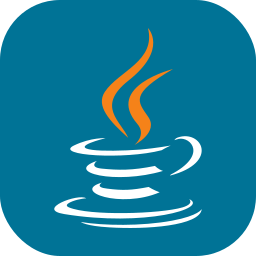
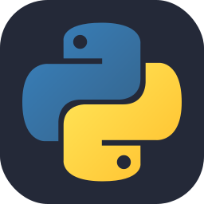
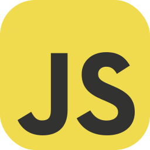
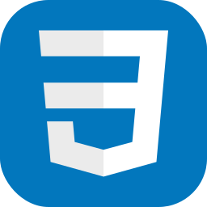
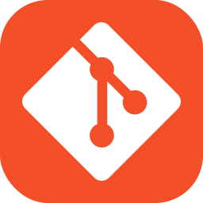
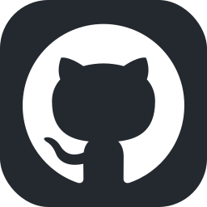
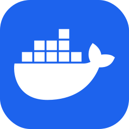
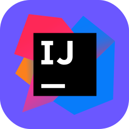
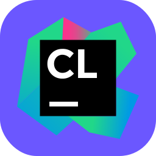
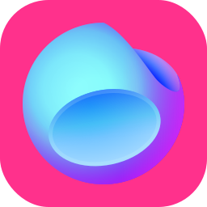

### 👋 Hi There! I'm Sombeyyy

    
    
    
    

    I'm Bastian - better known on the Internet as Sombeyyy. I'm currently in an apprenticeship as an IT specialist for system integration.  
    In my free time, I enjoy reading up on a wide range of IT topics and trying them out. I have also discovered my love for
    Docker and would like to deepen my knowledge here.  
    I also implement various programming projects in my free time, which should make future projects easier for me in the future.
    Some of them will be available open source here.

#### My skills / What I'm currently learning

    
    
    
    
    
    
    
    
    
    
    
    

#### My IDEs

    
    
    
    

#### Stats

    
    

